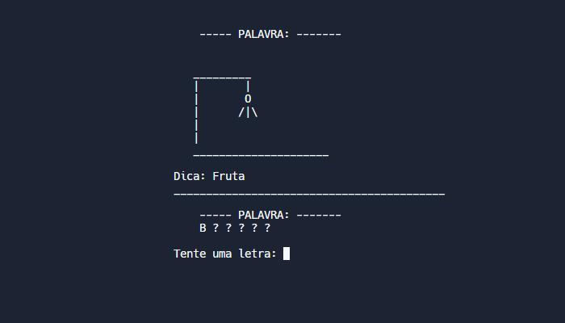

  <h1>Hangman Game</h1> 
   
  

 <h2>:bulb: Sobre o projeto</h2>

O <strong>Jogo da Forca</strong> (Hangman game) é um jogo de adivinhação de palavras onde uma pessoa pensa em uma palavra e a outra tenta adivinhar sugerindo letras.
Palpites corretos revelam as letras da palavra, enquanto palpites incorretos levam ao desenho de uma figura da forca.
O jogo continua até que a palavra seja adivinhada ou a figura da forca seja completada.  
Este jogo foi criado usando a linguagem <strong>C</strong> durante minhas aulas de programação na faculdade para aprender e praticar mais sobre C e <strong>gerenciamento de memória</strong>, embora o uso dessa linguagem tenha gerado algumas limitações e signifique que o jogo <strong>atualmente não aceita palavras com acentos</strong>.

 

 <h2>:test_tube: Links</h2>

 - [Clique para testar o projeto](https://replit.com/@KarenKnup/Jogo-da-Forca) **[PORTUGUÊS]**

 - [Click to test the project](https://replit.com/@KarenKnup/Hangman-Game) **[ENGLISH]**
 
 
